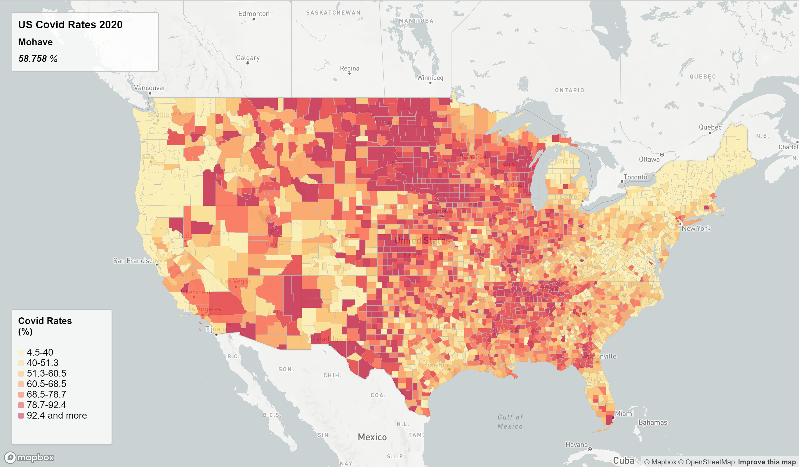
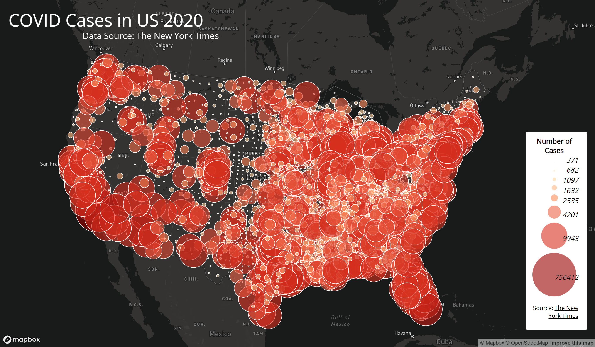

# Mapping US COVID in 2020
In this project, we design two web map applications, each mapping data of the US covid cases in 2020 into thematic maps, one is a choropleth map of the covid-19 rates and the other is a proportional symbols map of covid-19 counts of cases. To accomplish this project, we use Mapbox resources including `mapbox-gl-js.css`, `mapbox-gl-js.js`, and [basemap gallery](https://www.mapbox.com/gallery/).

## Map 1
[Map 1](https://cathyluc.github.io/mapping_US_COVID_2020/map1.html) is a choropleth map showing the covid-19 rates in US in 2020 on county level. Readers can hover on to a county and see a pop-up window displaying the rate fo covid-19 of that county.

## Map 2
[Map 2](https://cathyluc.github.io/mapping_US_COVID_2020/map2.html) is a proportional symbols map showing the counts of covid-19 cases in 2020 in US. The size of the circle indicates the magnitude of cases. The readers can click on each circle to see the number of cases of in each county.

## Data Source
- [The New York Times](https://github.com/nytimes/covid-19-data/blob/43d32dde2f87bd4dafbb7d23f5d9e878124018b8/live/us-counties.csv)
- [2018 ACS 5 year estimates](https://data.census.gov/table?g=0100000US$050000&d=ACS+5-Year+Estimates+Data+Profiles&tid=ACSDP5Y2018.DP05&hidePreview=true)
- [The US Census Bureau](https://www.census.gov/geographies/mapping-files/time-series/geo/carto-boundary-file.html)

## Acknowledgement
The data has been processed by Steven Bao.